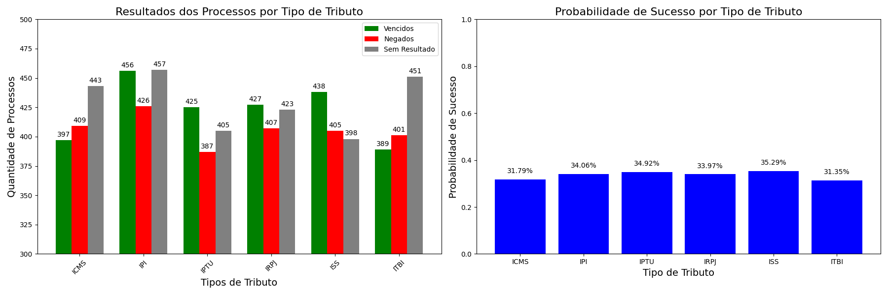

# Análise Jurídica de Processos Tributários

Este projeto tem como objetivo analisar e visualizar dados jurídicos relacionados a processos tributários, proporcionando insights sobre a distribuição dos casos, tipos de tributo, decisões e probabilidades de sucesso. A análise é realizada utilizando Python e bibliotecas como `Pandas`, `Matplotlib` e `NumPy`.

## Índice

- [Descrição](#descrição)
- [Objetivo](#objetivo)
- [Tecnologias Utilizadas](#tecnologias-utilizadas)
- [Exemplos de Gráficos](#exemplos-de-gráficos)

## Descrição

Este repositório contém uma análise detalhada de um conjunto de dados fictício que simula 10.000 processos tributários jurídicos. O foco da análise é compreender as distribuições dos tipos de tributo, os resultados das ações (vencidos, negados e sem resultado) e a probabilidade de aprovação para novos processos em diferentes tipos de tributo.

Além disso, o projeto explora como essas informações podem ser usadas para melhorar a tomada de decisões estratégicas no campo jurídico, principalmente em escritórios de advocacia que lidam com questões tributárias.

## Objetivo

O principal objetivo deste projeto é:

- Analisar dados de processos tributários para identificar padrões e tendências.
- Criar visualizações que ajudem a entender a distribuição dos casos e os resultados.
- Calcular probabilidades de sucesso em novos processos baseados em dados históricos.
- Demonstrar as habilidades de análise de dados utilizando Python, Excel e ferramentas de visualização.

## Tecnologias Utilizadas

- **Python**: Linguagem principal utilizada para processamento e análise dos dados.
- **Pandas**: Biblioteca para manipulação de dados e análise estatística.
- **Matplotlib**: Biblioteca para visualização de gráficos e informações.

## Exemplos de Gráficos
(images/grafico_resultados_processos.png)

### Resultados dos Processos e Probabilidade de Sucesso por Tipo de Tributo

Este gráfico mostra tanto a distribuição dos resultados (vencidos, negados, sem resultado) dos processos tributários, quanto a probabilidade de sucesso para cada tipo de tributo (ex: IPTU, ICMS). Ambos os gráficos são exibidos na mesma imagem.

---

Se você deseja aprender mais sobre como esses gráficos foram gerados ou realizar sua própria análise de dados jurídicos, sinta-se à vontade para explorar o código e adaptá-lo conforme necessário.
